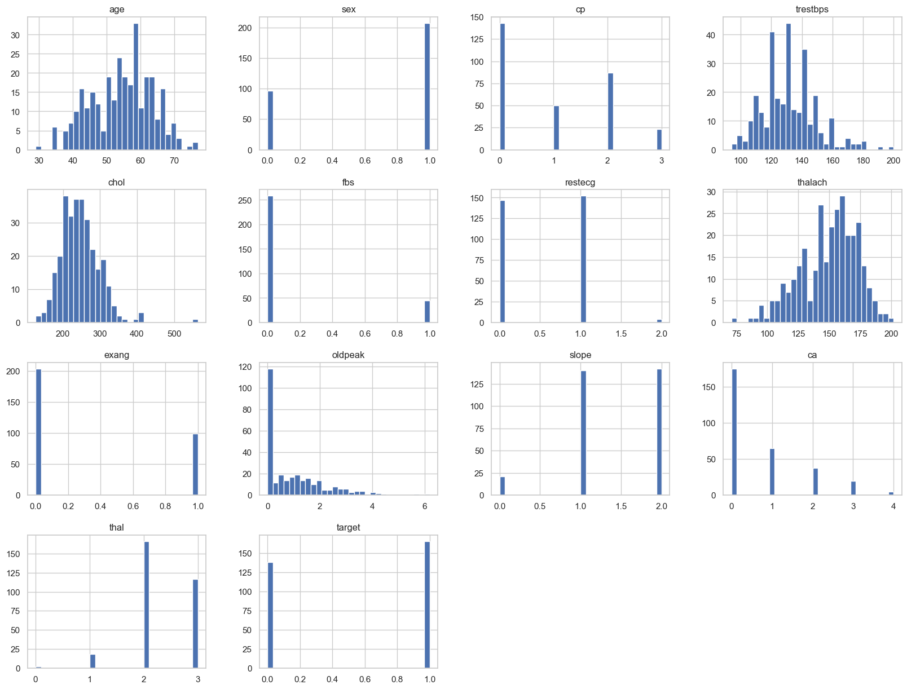
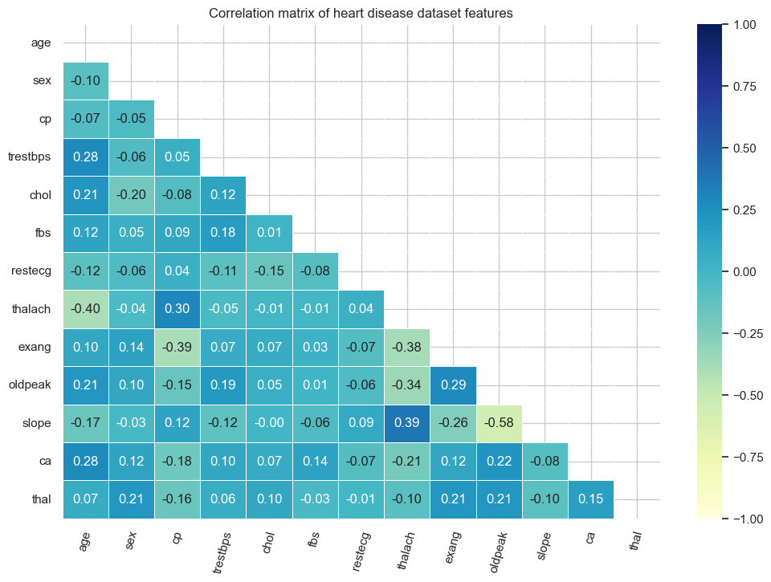

# Predicting heart disease using machine learning

## Overview

Health is a crucial part of everyone’s life. However, owing to multiple reasons like unhealthy lifestyles, work stress, psychological strain, and external factors such as pollution, hazardous work environment, and lack of proper health services, millions of people worldwide fall prey to chronic ailments like cardiovascular diseases (CVD), which affect both the heart and blood vessels, resulting in death or disability. Early detection of heart disease and other cadiovascular diseases can potentially cure and save innumerable patients. 

## 1. Business Understanding

In a statement,

> Given clinical parameters about a patient, can we predict whether or not they have heart disease?

**Success Criteria**

Generate a model that can accurately predict the likelihood of having heart disease with an accuracy score of 90%

## 2. Data Understanding

The original data came from the Cleavland data from the [UCI Machine Learning Repository](https://archive.ics.uci.edu/ml/datasets/heart+Disease). There is also a version of it available on [Kaggle.](https://www.kaggle.com/datasets/sumaiyatasmeem/heart-disease-classification-dataset). The data consists of 1 csv file.

Our data consists of 14 numerical columns.

13 feature variables and 1 target variable

**Overview of dataset**

## Data Preparation and Pipeline Construction

This section involves constructing our model pipelines and ensuring we take care of future scenarios such as one-hot encoding the categorical features and scaling the continuous features.
I decided to use a pipeline in this step because I wanted the flow of my data processing and my modeling to be well-organized and easily applied to any new incoming data

Before the construction of the pipeline, I decided to check for any columns that were correlated to each other

